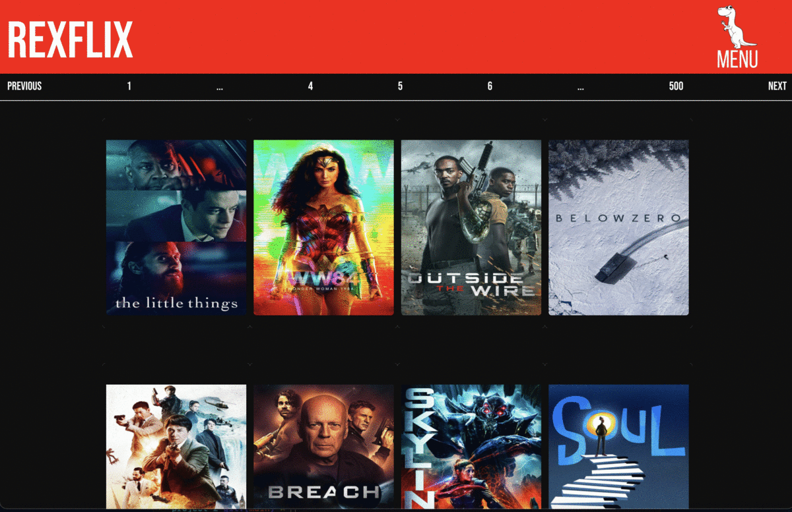
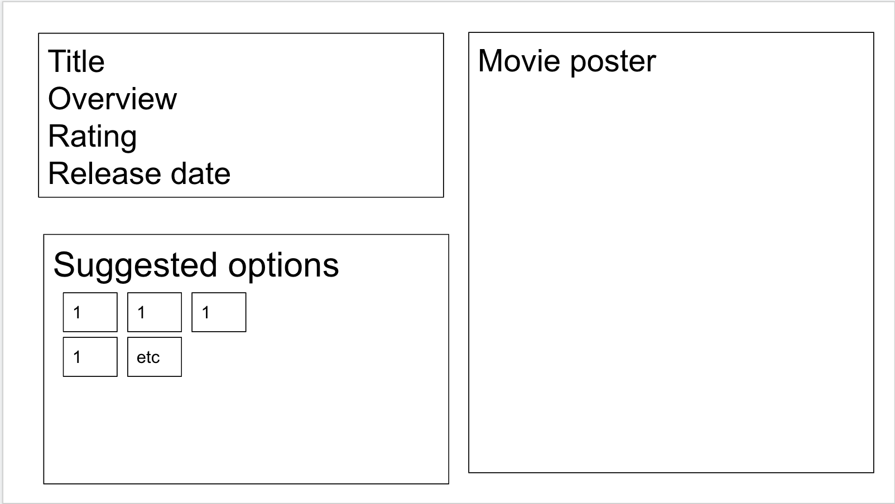

 

# Project 2 - REXFLIX 🦖🍿

## Overview

This was the second project of the Software Engineering Immersive course with GA. It was a 48-hr pair programming hackathon, challenging us to work together to create a single page app. This was my first paired project and I really enjoyed it.

Ypu can find a deployed version of this project here: [REXFLIX](https://lydiarrrw.github.io/project-2/)

## The Brief
* Consume a public API
* Use functional components
* Include a router with several pages
* Include wireframes, designed before building the app
* Use semantic HTML
* Be deployed online

## Technologies used
* React
* React router
* Insomnia
* Bulma
* React pagination component ([https://www.npmjs.com/package/react-paginate]())
* JSX
* JavaScript (ES6)
* HTML
* SCSS
* Git and GitHub
* The Movie Database API ([https://developers.themoviedb.org/3/getting-started/introduction]()

## Approach

###API - choice and limitations

After searching through APIs, we decided on the Movie Database API to create a movie recommendations site.

We wanted to include the following features:

* Homepage showing popular movies to browse
* Find movies by genre, using a menu option
* Individual movie pages, with list of film recommendations
* Mobile responsive
* Navigation via react router

As the API only returns 20 results at a time, we used a react pagnation component to allow users browse through movies.

This API required us to have an API key, which we have hidden in a .env file for security and best practice.

We also created some wireframes for our project to help us plan and agree how Rexflix should look. Here's a the movie page example:

### Preventing blank areas

Some of the movies in the API don't have movie posters available. To avoid showing the missing image, we filtered out movies without images after getting information from the API.
`.then(data => {
        const filteredPoster = data.data.results.filter(poster => {
          return poster.poster_path
        })
        updateMovies(filteredPoster)`
        

### Movie pages and recommendations

When you click on a movie poster, it takes you to the individual movie page. We did this by passing the ID through and into the URL to fetch information from the API. We could then also use this movie ID to request the recommendations from the API, update the information when the user clicked on a recommended movie.

### Styling

We decided to use Bulma to do most of the styling for this project, utlising Bulma cards. This meant we had to learn this framework quite quickly, which proved challenging. We ended up using a hybrid with regular SCSS to get it to look how we wanted. To improve the project, I'd look further into using Bulma tiles to organise content on the individual movie pages.

## Improvements/bugs to fix 🐜 🐛 🕷

This project was a 48 hour 'hackathon' and given more time, there are a few improvements I'd like to make. These include:

* With the react pagination component, clicking on page 1 or 2 gives you the same set of results. 
* The menu bar requires you to click on the dinosaur icon, or 'close' to close it. I would make it so when you click anywhere on the page, it disappears, as well as making it more responsive.
* Some of the films don't have results to show recommended movies, so I'd build in a message to make sure it showed something where these don't appear.
* Add a search function.

This was a great lesson in planning our work to get a great MVP within a limited time frame.

## Artwork and fonts

* Google fonts - Bebas Neue
* Dinosaur logo - Canva logo creator
 
